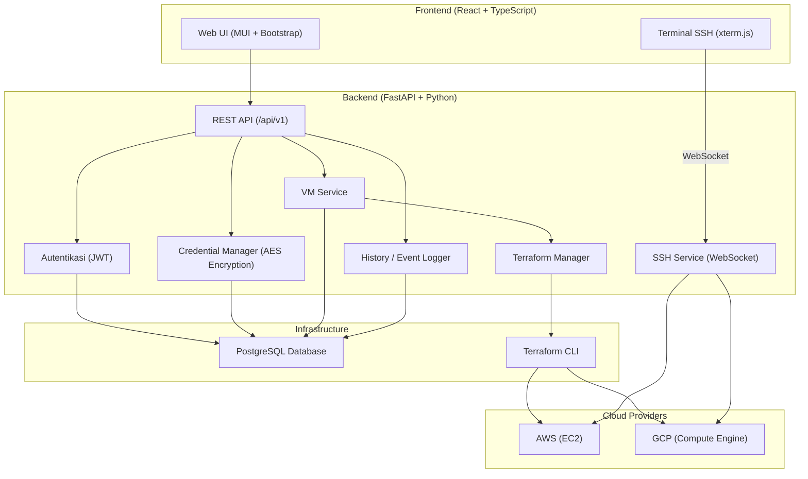

# 📋 Penjelasan Project Cloud VM Management & Panduan Setup

## 🎯 Apa Itu Project Ini?

Project ini adalah **Platform Manajemen Virtual Machine (VM) Multi-Cloud** — sebuah aplikasi web full-stack yang memungkinkan pengguna untuk **membuat, mengelola, dan mengakses VM** di cloud provider **AWS** dan **Google Cloud Platform (GCP)** melalui satu antarmuka web terpadu.

> [!IMPORTANT]
> Ini adalah project Tugas Akhir (TA) yang menggabungkan teknologi **Infrastructure as Code (Terraform)**, **Cloud Computing**, dan **Web Development** dalam satu aplikasi.

---

## 🏗️ Arsitektur Sistem



---

## 🧩 Fitur Utama

| Fitur | Deskripsi |
|---|---|
| **Register & Login** | Sistem autentikasi pengguna dengan JWT token |
| **Credential Management** | Simpan & kelola kredensial AWS/GCP (terenkripsi AES) |
| **Quick Deploy VM** | Deploy VM cepat dari preset template (Low Cost, Web Server, App Server) |
| **Custom Deploy VM** | Deploy VM dengan konfigurasi custom (machine type, disk, region, dll) |
| **Multi Deploy VM** | Deploy beberapa VM sekaligus |
| **Dashboard** | Tampilan semua VM yang aktif beserta statusnya |
| **VM Details** | Lihat detail VM (IP, status, spesifikasi) |
| **SSH Terminal** | Akses terminal SSH langsung dari browser via WebSocket + xterm.js |
| **Deployment History** | Riwayat semua aktivitas deployment |

---

## 🛠️ Tech Stack

### Backend
- **Framework**: FastAPI (Python)
- **Database**: PostgreSQL + SQLAlchemy ORM + Alembic (migration)
- **Auth**: JWT (python-jose) + bcrypt
- **Cloud SDK**: boto3 (AWS), google-cloud-compute (GCP)
- **IaC**: Terraform + python-terraform
- **Encryption**: PyCryptodome / cryptography (untuk credential)
- **SSH**: WebSocket-based SSH proxy

### Frontend
- **Framework**: React 19 + TypeScript (Create React App)
- **UI Library**: MUI (Material UI) v7 + Bootstrap 5
- **HTTP Client**: Axios
- **Terminal**: xterm.js (emulator terminal di browser)
- **Styling**: TailwindCSS 3 + CSS
- **Routing**: React Router v7
- **Notifications**: react-hot-toast

---

## 📁 Struktur Project

```
cloud-vm/
├── backend/
│   ├── .env                    # Konfigurasi environment backend
│   ├── requirements.txt        # Dependencies Python
│   ├── alembic.ini             # Konfigurasi Alembic migration
│   ├── migrations/             # File-file migration database
│   ├── app/
│   │   ├── main.py             # Entry point FastAPI
│   │   ├── config.py           # Settings & konfigurasi
│   │   ├── database.py         # Koneksi database PostgreSQL
│   │   ├── auth/               # Modul autentikasi (JWT, login, register)
│   │   ├── users/              # Modul manajemen user
│   │   ├── credentials/        # Modul manajemen kredensial cloud (enkripsi)
│   │   ├── vm/                 # Modul manajemen VM (AWS/GCP manager, Terraform)
│   │   ├── ssh/                # Modul SSH (WebSocket terminal, OS Login)
│   │   └── history/            # Modul history/event logging
│   └── terraform/
│       ├── aws/                # Template Terraform untuk AWS EC2
│       └── gcp/                # Template Terraform untuk GCP Compute Engine
│
├── frontend/
│   ├── .env                    # Konfigurasi environment frontend
│   ├── package.json            # Dependencies Node.js
│   └── src/
│       ├── App.tsx             # Root component + routing
│       ├── pages/              # Halaman (Dashboard, Login, CreateVM, dll)
│       ├── components/         # Komponen reusable (QuickDeploy, CustomDeploy, dll)
│       ├── services/           # API service layer (axios calls)
│       ├── contexts/           # React Context (AuthContext)
│       ├── hooks/              # Custom React hooks
│       ├── types/              # TypeScript type definitions
│       └── utils/              # Utility functions
│
└── package.json                # Root package.json
```

---

## 🚀 Panduan Setup (Step-by-Step)

### Prasyarat yang Harus Diinstall

| Software | Versi Minimal | Kegunaan |
|---|---|---|
| **Python** | 3.10+ | Backend runtime |
| **Node.js** | 18+ | Frontend runtime |
| **npm** | 9+ | Package manager frontend |
| **PostgreSQL** | 14+ | Database |
| **Terraform** | 1.5+ | Infrastructure as Code |
| **Git** | 2.x | Version control |

> [!TIP]
> Untuk mengecek apakah sudah terinstall, jalankan: `python --version`, `node --version`, `npm --version`, `psql --version`, `terraform --version`

---

### Step 1: Clone Repository

```bash
git clone <repository_url>
cd cloud-vm
```

---

### Step 2: Setup Database PostgreSQL

1. **Pastikan PostgreSQL sudah running** sebagai service di komputer kamu.

2. **Buat database** yang dibutuhkan:
   ```sql
   -- Buka psql atau pgAdmin, lalu jalankan:
   CREATE DATABASE cloud_management;
   ```

3. **Pastikan user `postgres`** bisa mengakses database dengan password `postgres` (sesuai [.env](file:///d:/Kuliah/TA/cloud-vm/backend/.env)), atau ubah konfigurasi di [backend/.env](file:///d:/Kuliah/TA/cloud-vm/backend/.env):
   ```env
   POSTGRES_USER=postgres
   POSTGRES_PASSWORD=postgres
   POSTGRES_DB=cloud_management
   POSTGRES_HOST=localhost
   POSTGRES_PORT=5432
   ```

---

### Step 3: Setup Backend (FastAPI)

1. **Masuk ke folder backend:**
   ```bash
   cd backend
   ```

2. **Buat virtual environment Python:**
   ```bash
   python -m venv .venv
   ```

3. **Aktifkan virtual environment:**
   ```bash
   # Windows (PowerShell)
   .\.venv\Scripts\Activate.ps1

   # Windows (CMD)
   .\.venv\Scripts\activate.bat

   # Linux/macOS
   source .venv/bin/activate
   ```

4. **Install dependencies:**
   ```bash
   pip install -r requirements.txt
   ```

5. **Jalankan migration database (opsional, tabel akan dibuat otomatis):**
   ```bash
   alembic upgrade head
   ```

   > [!NOTE]
   > Aplikasi secara otomatis membuat tabel saat startup via `Base.metadata.create_all()` di [main.py](file:///d:/Kuliah/TA/cloud-vm/backend/app/main.py). Alembic hanya diperlukan jika ada migration spesifik.

6. **Jalankan backend server:**
   ```bash
   uvicorn app.main:app --host 0.0.0.0 --port 8000 --reload
   ```

7. **Verifikasi backend berjalan:**
   - Buka browser: [http://localhost:8000](http://localhost:8000) — harus menampilkan JSON welcome message
   - API Docs: [http://localhost:8000/docs](http://localhost:8000/docs) — Swagger UI

---

### Step 4: Setup Frontend (React)

1. **Buka terminal baru**, masuk ke folder frontend:
   ```bash
   cd frontend
   ```

2. **Install dependencies:**
   ```bash
   npm install
   ```

3. **Jalankan frontend development server:**
   ```bash
   npm start
   ```

4. **Verifikasi frontend berjalan:**
   - Buka browser: [http://localhost:3000](http://localhost:3000)
   - Halaman login akan muncul

---

### Step 5: Setup Terraform (untuk Deploy VM)

1. **Install Terraform** dari [terraform.io/downloads](https://developer.hashicorp.com/terraform/downloads)

2. **Inisialisasi Terraform** untuk tiap provider:
   ```bash
   # Untuk GCP
   cd backend/terraform/gcp
   terraform init

   # Untuk AWS
   cd backend/terraform/aws
   terraform init
   ```

3. **Pastikan Terraform dapat diakses dari PATH** sistem.

---

### Step 6: Setup Kredensial Cloud Provider

Setelah aplikasi berjalan, login ke web app dan setup kredensial:

#### Untuk GCP:
1. Buat **Service Account** di Google Cloud Console
2. Download **JSON key file**
3. Upload melalui halaman **Credentials Management** di web app

#### Untuk AWS:
1. Buat **IAM User** dengan akses EC2
2. Dapatkan **Access Key ID** dan **Secret Access Key**
3. Masukkan melalui halaman **Credentials Management** di web app

---

### Step 7: Mulai Menggunakan Aplikasi

1. **Register** akun baru di halaman `/register`
2. **Login** dengan akun yang sudah dibuat
3. **Tambah credential** cloud provider di menu Credentials
4. **Buat VM** dengan memilih salah satu mode:
   - **Quick Deploy** — Preset template (Low Cost / Web Server / App Server)
   - **Custom Deploy** — Konfigurasi manual
   - **Multi Deploy** — Deploy banyak VM sekaligus
5. **Monitor VM** di Dashboard
6. **SSH ke VM** langsung dari browser melalui halaman VM Details

---

## ⚠️ Troubleshooting Umum

| Masalah | Solusi |
|---|---|
| `psycopg2` gagal install | Install `psycopg2-binary` atau install PostgreSQL dev headers |
| Database connection error | Pastikan PostgreSQL running dan credential di [.env](file:///d:/Kuliah/TA/cloud-vm/backend/.env) benar |
| CORS error di browser | Pastikan `CORS_ORIGINS` di [.env](file:///d:/Kuliah/TA/cloud-vm/backend/.env) backend mencakup URL frontend |
| Terraform not found | Pastikan `terraform` ada di system PATH |
| Frontend proxy error | Pastikan backend jalan di port 8000 (sesuai `proxy` di [frontend/package.json](file:///d:/Kuliah/TA/cloud-vm/frontend/package.json)) |
| `npm install` error | Coba hapus `node_modules` dan [package-lock.json](file:///d:/Kuliah/TA/cloud-vm/package-lock.json), lalu `npm install` ulang |

---

## 🔗 URL Penting (Development)

| Service | URL |
|---|---|
| Frontend | [http://localhost:3000](http://localhost:3000) |
| Backend API | [http://localhost:8000](http://localhost:8000) |
| Swagger Docs | [http://localhost:8000/docs](http://localhost:8000/docs) |
| ReDoc | [http://localhost:8000/redoc](http://localhost:8000/redoc) |
| Health Check | [http://localhost:8000/health](http://localhost:8000/health) |
